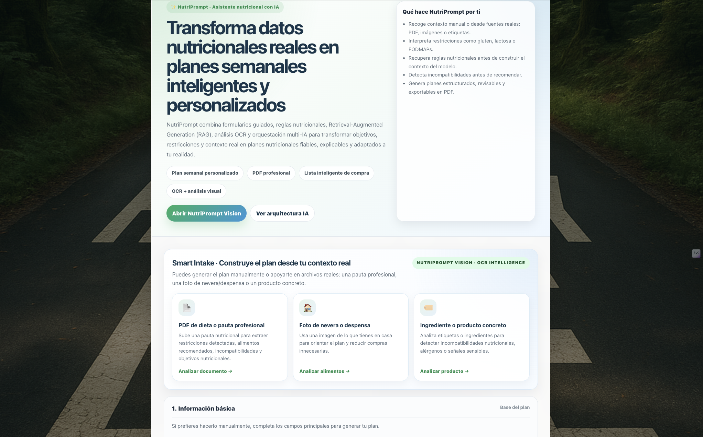
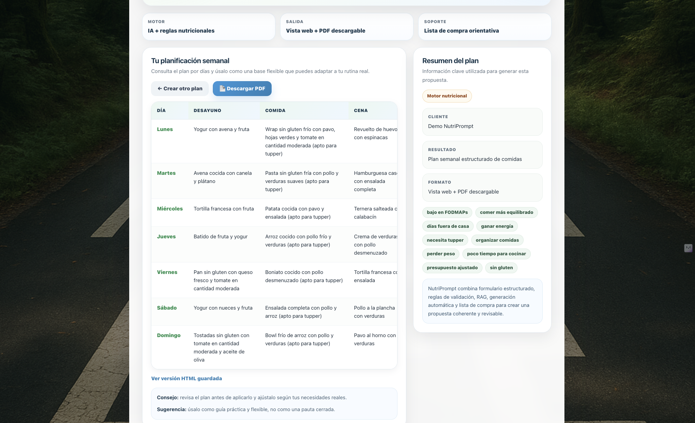
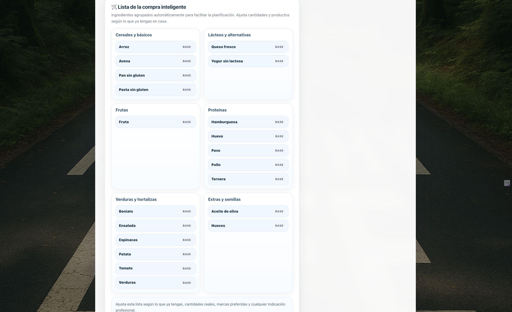
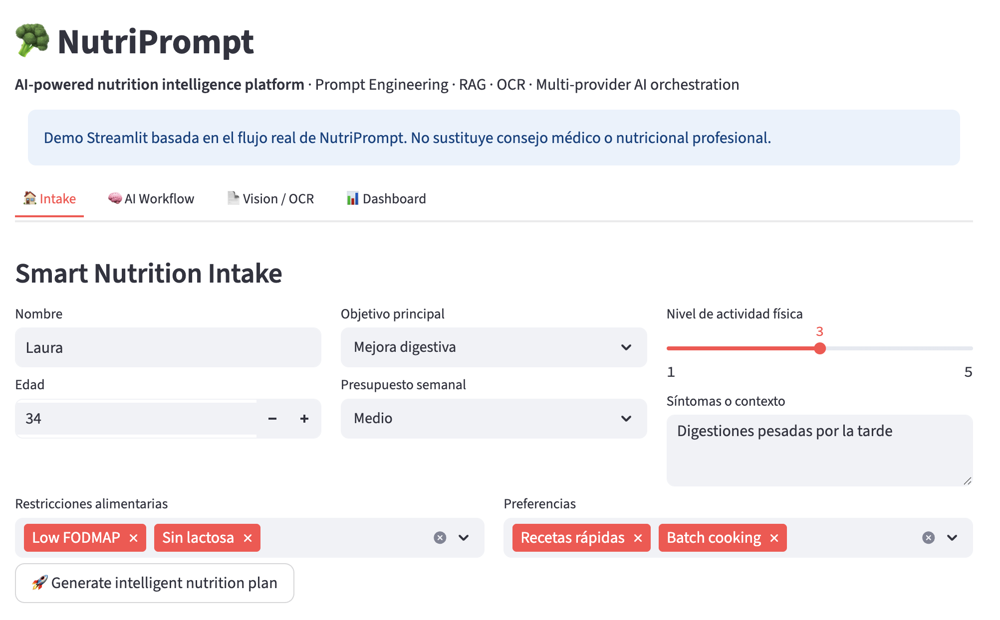
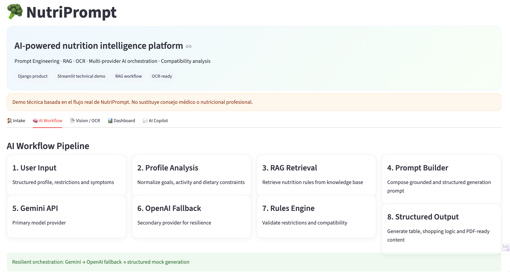
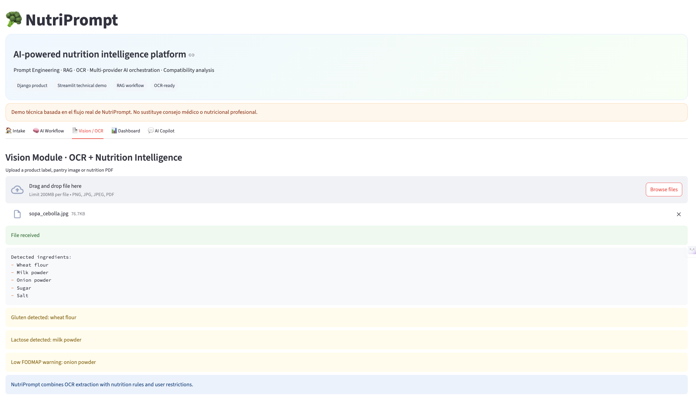
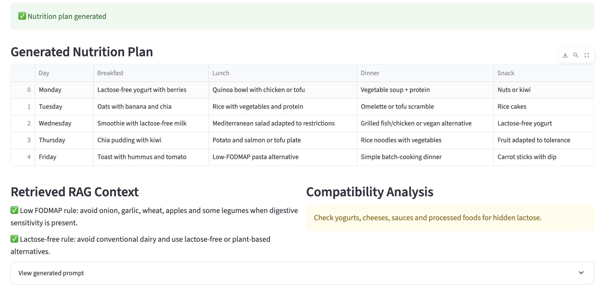
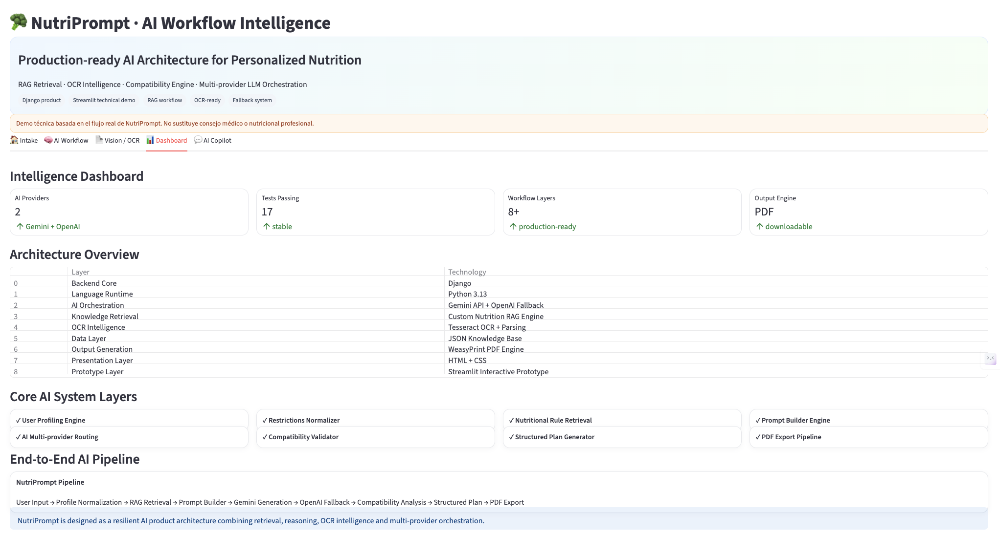
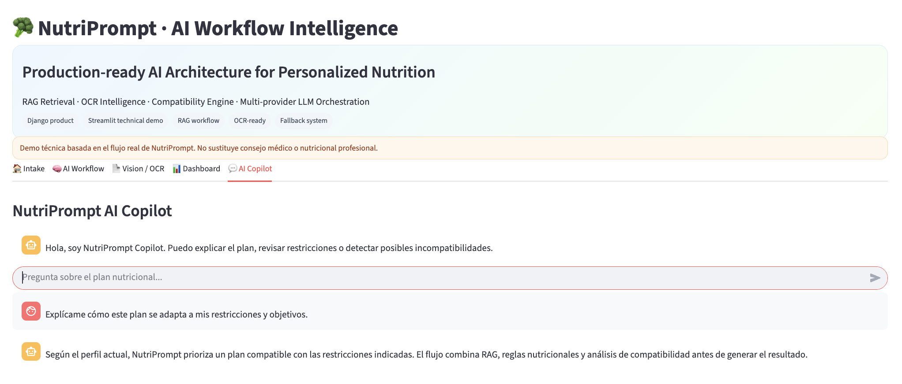

# 🥦 NutriPrompt

> **NutriPrompt is an AI-powered nutrition intelligence platform that transforms structured health data into explainable, contextualized and actionable nutrition workflows.**

Built with **Django**, **Prompt Engineering**, **Retrieval-Augmented Generation (RAG)**, **OCR pipelines**, **compatibility engines** and **multi-provider AI orchestration**.

NutriPrompt is not a simple meal-plan generator.

It is a **production-oriented AI architecture** designed to demonstrate how modern intelligent systems can combine structured user data, domain knowledge, retrieval systems, validation layers and resilient orchestration to deliver reliable and explainable outputs.


---

# ✨ Product Vision

Nutrition planning is not just a content generation problem.

A reliable AI nutrition system must understand:

* Personal goals
* Dietary restrictions
* Digestive conditions
* Ingredient compatibility
* Nutritional context
* Budget constraints
* Lifestyle habits

NutriPrompt approaches this challenge as an **intelligent decision-support workflow**, not as a chatbot.

Its architecture enriches every request before generation.

This produces:

✅ Grounded outputs
✅ Fewer hallucinations
✅ Explainable recommendations
✅ Compatibility-aware suggestions
✅ Resilient provider orchestration
✅ Production-oriented AI workflows

---

# 🎯 Why This Matters

Most AI nutrition tools rely on direct prompting.

This creates major limitations:

* No domain grounding
* Weak restriction handling
* No ingredient validation
* No compatibility analysis
* No retrieval logic
* No fallback resilience

For healthcare-adjacent workflows, this is not enough.

NutriPrompt addresses this by structuring AI generation as a layered architecture.

It is not built to simply **generate meal plans**.

It is built to demonstrate how **production-grade AI systems** should be designed.

---

# 💡 Solution

NutriPrompt combines multiple intelligence layers:

* Prompt Engineering
* Retrieval-Augmented Generation (RAG)
* OCR-based document analysis
* Nutrition knowledge systems
* Compatibility engines
* Multi-provider orchestration
* Explainability layers

Instead of sending raw input directly into an LLM, NutriPrompt enriches every request through multiple reasoning layers before generation.

This improves:

* Contextual consistency
* Reliability
* Explainability
* Resilience

---

# 🏗 System Architecture

```text
User Input
      ↓
Structured Forms
      ↓
Profile Analysis
      ↓
RAG Knowledge Retrieval
      ↓
Prompt Builder
      ↓
Gemini API
      ↓ (Fallback)
OpenAI API
      ↓
Structured JSON Output
      ↓
Nutrition Rules Engine
      ↓
Compatibility Analysis
      ↓
HTML Rendering
      ↓
Shopping Intelligence
      ↓
PDF Generation
      ↓
AI Copilot Layer
```

---

# 📸 Product Walkthrough · Django Application

## 1. Smart Nutrition Intake

NutriPrompt transforms structured user information into personalized nutrition plans using:

* Goal understanding
* Food preferences
* Digestive symptoms
* Dietary restrictions
* Budget-aware logic
* Real-life context



---

## 2. Generated Nutrition Plan

The AI output includes:

* Structured weekly meal planning
* Compatibility-aware recommendations
* Practical tupper adaptation
* Explainable profile tags
* Downloadable PDF



---

## 3. Intelligent Shopping Layer

NutriPrompt transforms the generated plan into an organized shopping list:

* Grouped by category
* Optimized for planning
* Structured for execution
* Practical for real-life use

This turns AI generation into actionable utility.



---

# 🚀 Streamlit Technical Demo

NutriPrompt also includes a dedicated **Streamlit demo** built to expose the internal AI workflow in a recruiter-friendly and architecture-focused format.

Designed for:

* Technical presentations
* AI product demos
* Architecture walkthroughs
* Portfolio storytelling

---

## Intake Layer

Structured nutrition intake.



---

## AI Workflow Orchestration

End-to-end orchestration pipeline.



---

## OCR Intelligence Layer

Ingredient extraction and incompatibility detection.



---

## Structured Output Layer

Weekly plan generation.



---

## Technical Dashboard

Workflow observability and stack overview.



---

## AI Copilot Layer

NutriPrompt includes an explainability assistant capable of:

* Explaining generated plans
* Reviewing restrictions
* Validating ingredients
* Providing contextual reasoning

This transforms NutriPrompt from a generator into an interactive AI decision-support system.



---

# 🧠 Core Capabilities

## Personalized Nutrition Planning

Generate structured weekly plans based on:

* User objectives
* Dietary restrictions
* Symptoms
* Food preferences
* Activity levels
* Budget
* Daily routines

---

## Retrieval-Augmented Generation (RAG)

NutriPrompt retrieves nutrition rules before generation.

Examples:

* Low FODMAP recommendations
* Gluten-free alternatives
* Lactose-free substitutions
* Digestive-safe planning
* Shopping optimization logic

This improves consistency and reduces hallucinations.

---

## OCR + Ingredient Intelligence

NutriPrompt analyzes:

* Product labels
* Nutrition PDFs
* Pantry inventories
* Fridge scans
* Ingredient lists

OCR results are validated against user restrictions.

---

## Compatibility Engine

NutriPrompt evaluates:

* User restrictions
* Retrieved nutrition rules
* OCR-detected ingredients

To detect incompatibilities before recommendation.

---

## Shopping Intelligence

Generated plans are converted into categorized shopping lists.

This creates:

* Better planning
* Easier execution
* Lower user friction

---

# ⚡ Resilient AI Orchestration

NutriPrompt implements fault-tolerant provider logic:

```text
Gemini API
      ↓
OpenAI Fallback
      ↓
Structured Mock Generation
```

Benefits:

* Stable demos
* Graceful degradation
* Provider independence
* Predictable outputs

---

# 🧠 AI Engineering Concepts Demonstrated

This project showcases:

* Prompt Engineering
* Retrieval-Augmented Generation (RAG)
* OCR Pipelines
* Multi-provider orchestration
* Structured AI outputs
* Explainable AI workflows
* Rule-based reasoning
* Compatibility engines
* Shopping intelligence
* Product-oriented AI architecture
* Service-oriented design
* Fallback resilience

---

# ⚙️ Technology Stack

| Layer         | Technology              |
| ------------- | ----------------------- |
| Backend       | Django                  |
| Language      | Python 3.13             |
| AI Providers  | Gemini API + OpenAI API |
| Retrieval     | Custom Nutrition RAG    |
| OCR           | Tesseract OCR           |
| Data          | JSON                    |
| PDF Rendering | WeasyPrint              |
| Frontend      | HTML + CSS              |
| Demo Layer    | Streamlit               |
| Testing       | Django Test Framework   |
| Architecture  | Service-Oriented Design |

---

# 📁 Project Structure

```text
NutriPrompt/
├── nutriprompt_app/
│   ├── services/
│   │   ├── ai/
│   │   ├── nutrition/
│   │   ├── profiles/
│   │   ├── rag/
│   │   ├── vision/
│   │   └── presentation/
│   ├── templates/
│   ├── tests/
│   └── views.py
│
├── scripts/
│   └── nutriprompt_demo.py
│
├── docs/
│   ├── screenshots/
│   │   ├── 01_home.png
│   │   ├── 02_plan.png
│   │   └── 03_shopping_list.png
│   └── streamlit_demo/
```

---

# 🧪 Test Coverage

Current automated validation includes:

* Prompt generation
* Knowledge retrieval
* Compatibility analysis
* OCR processing
* Context injection
* Structured outputs
* Shopping list generation

Run tests:

```bash
python manage.py test
```

Current suite:

```text
17 automated tests passing
```

---

# 🛠 Installation

```bash
git clone https://github.com/beatriangu/NutriPrompt.git
cd NutriPrompt

python3 -m venv venv
source venv/bin/activate

pip install -r requirements.txt
```

---

# ▶️ Run Django App

```bash
python manage.py runserver
```

Open:

```text
http://127.0.0.1:8000/
```

---

# ▶️ Run Streamlit Demo

```bash
streamlit run ./scripts/nutriprompt_demo.py
```

---

# ⚠️ Disclaimer

NutriPrompt provides informational guidance only.

It does not replace professional medical or nutritional advice.

All outputs should be reviewed by qualified professionals when appropriate.

---

# 👩‍💻 Author

**Bea Lamiquiz**

🌐 Portfolio: https://bchill.net
💻 GitHub: https://github.com/beatriangu
💼 LinkedIn: https://www.linkedin.com/in/bealamiquiz/

---

# ⭐ Support

If you find this project interesting:

⭐ Star the repository
🤝 Connect on LinkedIn
💬 Share feedback, ideas or improvements

