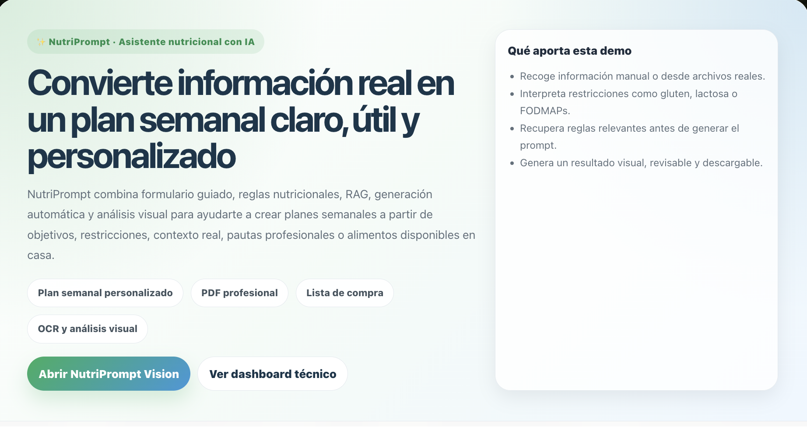
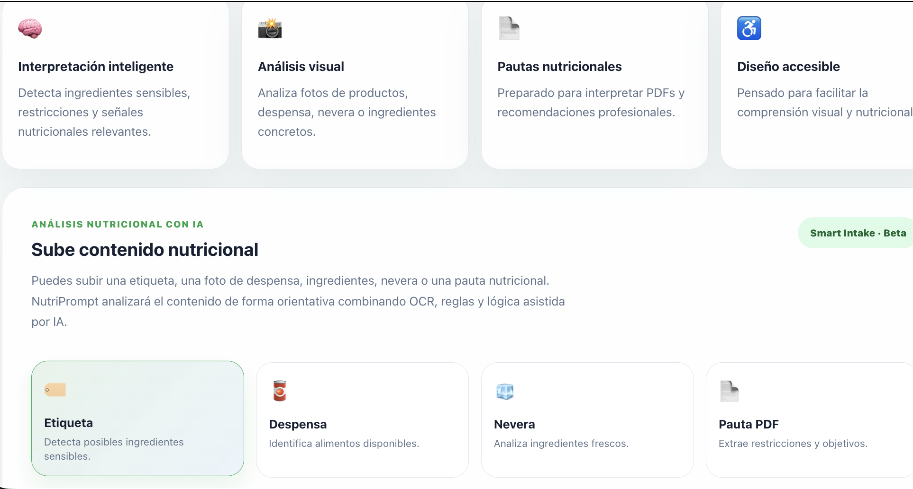
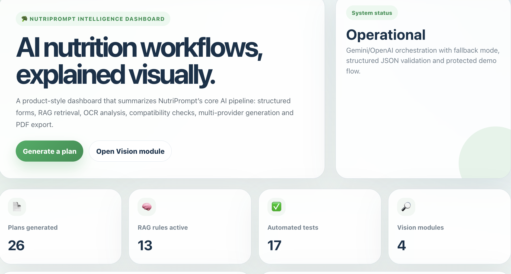
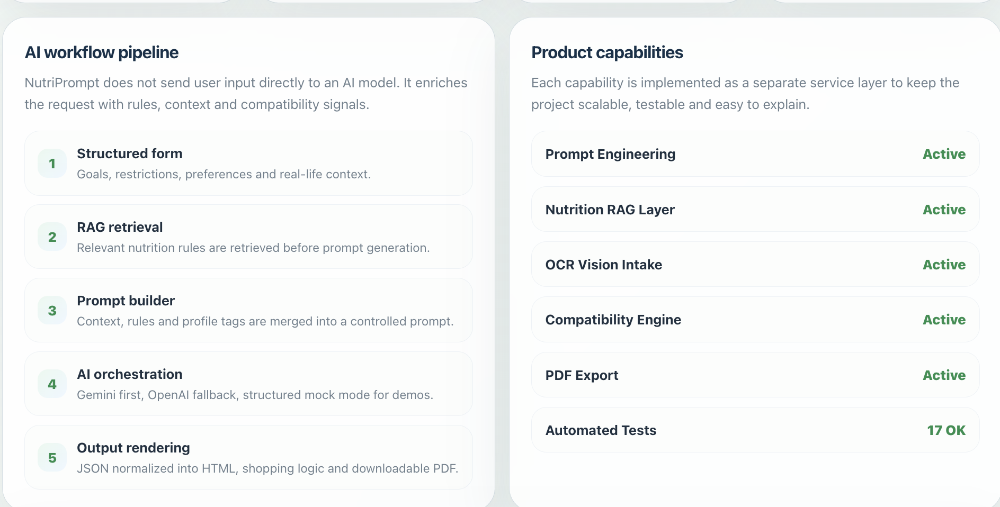
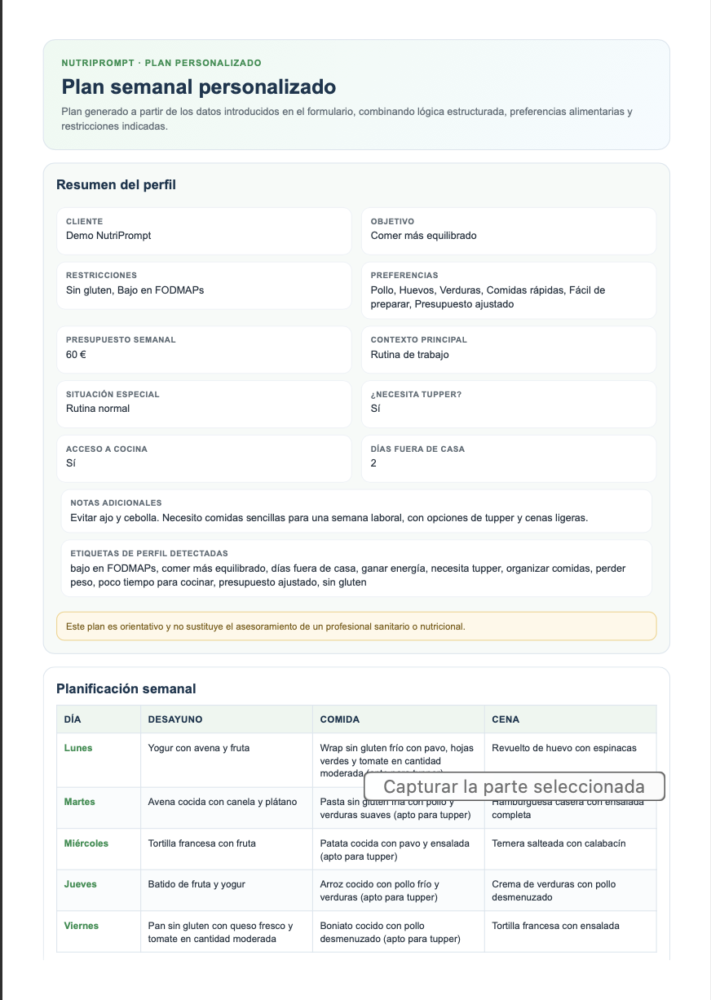

# 🥦 NutriPrompt

> **AI-powered nutrition intelligence platform built with Django, Prompt Engineering, Retrieval-Augmented Generation (RAG), OCR workflows and multi-provider AI orchestration.**
>
> NutriPrompt demonstrates how modern AI products can combine structured user data, domain knowledge, retrieval systems and intelligent orchestration to generate contextualized, explainable and actionable outputs.


---

# ✨ Overview

NutriPrompt is an AI-powered nutrition workflow platform designed to showcase the architecture behind intelligent, production-oriented AI applications.

Instead of sending user input directly to a language model, NutriPrompt enriches every request through multiple intelligence layers:

* Structured data collection
* Nutrition knowledge retrieval (RAG)
* OCR document analysis
* Compatibility validation
* Prompt Engineering
* Multi-provider AI orchestration

The result is a more reliable, explainable and context-aware AI workflow.

---

# 📸 Product Walkthrough

## Home · Smart Nutrition Intake

NutriPrompt transforms structured user information into personalized nutrition plans using Prompt Engineering, RAG retrieval and AI orchestration.



---

## Vision Module · OCR + Nutrition Intelligence

NutriPrompt Vision can analyze:

* Product labels
* Pantry inventories
* Fridge contents
* Nutrition PDFs

Combining OCR, nutrition rules and AI-assisted interpretation.



---

## Intelligence Dashboard · System Overview

A product-oriented dashboard designed to explain the complete AI workflow.

### Dashboard Overview



### AI Workflow Pipeline



---

## Generated Nutrition Plan

The final output includes:

* Weekly meal planning
* User profile summary
* Smart shopping list
* Downloadable PDF



---

# 🎯 Problem

Generating personalized nutrition plans with AI is not simply a text generation problem.

A robust solution must be able to:

* Understand user goals and restrictions
* Interpret nutrition documents and forms
* Detect conflicting ingredients
* Apply domain knowledge consistently
* Generate structured outputs suitable for real-world workflows

Large Language Models alone do not guarantee this consistency.

---

# 💡 Solution

NutriPrompt introduces a layered AI architecture that combines:

* Prompt Engineering
* Retrieval-Augmented Generation (RAG)
* OCR-based information extraction
* Nutrition knowledge systems
* Compatibility analysis
* Multi-provider AI orchestration

This approach improves contextual consistency, explainability and reliability.

---

# 🧠 Core Capabilities

## Personalized Nutrition Planning

Generate structured weekly plans based on:

* User objectives
* Dietary restrictions
* Food preferences
* Budget considerations
* Lifestyle context

## Nutrition Knowledge Retrieval (RAG)

Before generation, NutriPrompt retrieves relevant nutrition rules from its knowledge base.

Examples include:

* Low FODMAP guidance
* Gluten-free recommendations
* Lactose-free recommendations
* Meal planning guidance
* Shopping logic

This retrieved context is injected into the generation workflow to improve consistency and reduce hallucinations.

## OCR & Nutrition Intelligence

The platform can analyze:

* Nutrition PDFs
* Product labels
* Pantry inventories
* Fridge contents

OCR extraction is combined with nutrition rules and compatibility analysis to provide contextual insights.

## Compatibility Analysis

NutriPrompt evaluates:

* User restrictions
* Retrieved nutrition rules
* OCR-detected ingredients

to identify potential incompatibilities before generating recommendations.

---

# 🏗 System Architecture

```text
User Input
      ↓
Structured Forms
      ↓
Profile Analysis
      ↓
RAG Knowledge Retrieval
      ↓
Prompt Builder
      ↓
Gemini API
      ↓ (Fallback)
OpenAI API
      ↓
Structured JSON Output
      ↓
Nutrition Rules Engine
      ↓
Compatibility Analysis
      ↓
HTML Rendering
      ↓
PDF Generation
```

---

# 🧠 AI Engineering Concepts Demonstrated

This project showcases practical implementation of:

* Prompt Engineering
* Retrieval-Augmented Generation (RAG)
* OCR Pipelines
* Multi-provider AI orchestration
* Structured AI outputs
* Rule-based reasoning
* Compatibility engines
* Explainable AI workflows
* Service-oriented architecture
* Product-oriented AI design
* Resilient fallback systems

---

# ⚡ Resilient AI Orchestration

NutriPrompt implements a fault-tolerant generation workflow:

```text
Gemini API
      ↓
OpenAI Fallback
      ↓
Structured Mock Generation
```

Benefits:

* Stable demonstrations
* Graceful degradation
* Provider independence
* Consistent user experience

---

# ⚙️ Technology Stack

| Layer        | Technology              |
| ------------ | ----------------------- |
| Backend      | Django                  |
| Language     | Python 3.13             |
| AI Providers | Gemini API + OpenAI API |
| Retrieval    | Custom Nutrition RAG    |
| OCR          | Tesseract OCR           |
| Data         | JSON                    |
| PDF          | WeasyPrint              |
| Frontend     | HTML + CSS              |
| Testing      | Django Test Framework   |
| Architecture | Service-Oriented Design |

---

# 📁 Project Structure

```text
nutriprompt_app/
├── services/
│   ├── ai/
│   ├── nutrition/
│   ├── profiles/
│   ├── rag/
│   ├── vision/
│   └── presentation/
├── templates/
├── tests/
└── views.py
```

---

# 🧪 Test Coverage

Current automated validation includes:

* Prompt generation
* JSON parsing
* Knowledge base loading
* RAG retrieval
* Context building
* Prompt enrichment
* Compatibility workflows

```bash
python manage.py test
```

Current suite:

```text
17 automated tests passing
```

---

# 🛠 Installation

```bash
git clone https://github.com/beatriangu/NutriPrompt.git

cd NutriPrompt

python3 -m venv venv

source venv/bin/activate

pip install -r requirements.txt
```

---

# ▶️ Run

```bash
python manage.py runserver
```

Open:

```text
http://127.0.0.1:8000/
```

---

# ⚠️ Disclaimer

NutriPrompt provides informational guidance only.

It does not replace professional medical, nutritional or healthcare advice.

Recommendations generated by the platform should always be reviewed by qualified professionals when appropriate.

---

# 👩‍💻 Author

**Bea Lamiquiz**

🌐 Portfolio: https://bchill.net
💻 GitHub: https://github.com/beatriangu
💼 LinkedIn: https://www.linkedin.com/in/bealamiquiz/

---

# ⭐ Support

If you find the project interesting:

⭐ Star the repository
🤝 Connect on LinkedIn
💬 Share feedback, ideas or improvements


