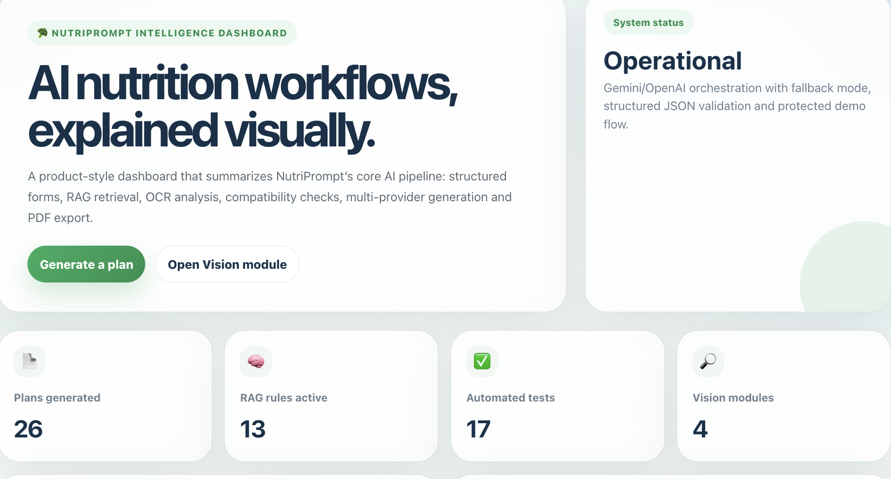
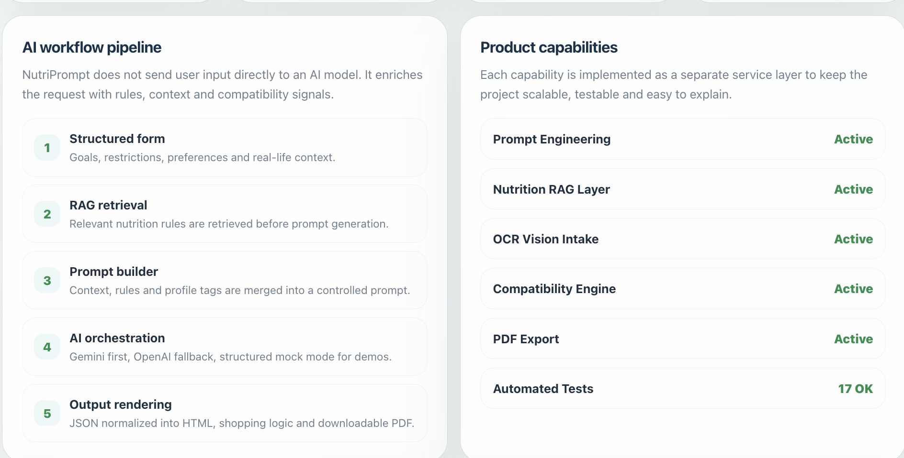
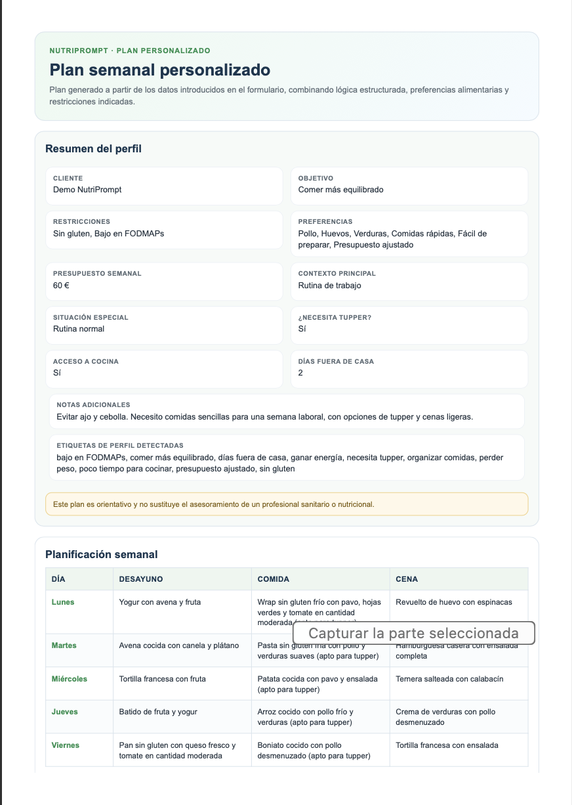
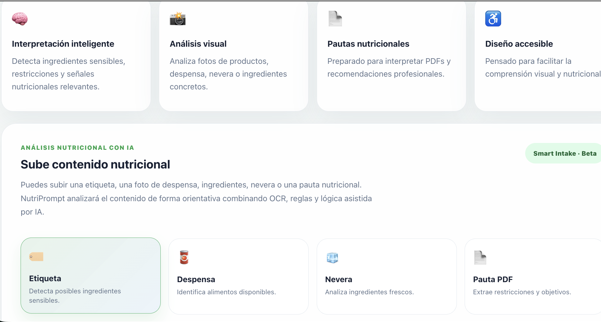

<div align="center">

# 🥦 NutriPrompt

### Applied AI · From structured context to validated, explainable outcomes

**Prompt Engineering · RAG · OCR · Multi-Provider LLM Orchestration · Validation · Structured Outputs**

<br>

[](https://www.python.org/)
[](https://www.djangoproject.com/)
[](https://nutriprompt-live.streamlit.app/)
[](https://ai.google.dev/)
[](https://openai.com/)


<br>

> **NutriPrompt is an Applied AI system designed to transform structured user context into retrieved, validated, explainable and actionable workflows.**

<br>

### 🚀 [TRY THE LIVE DEMO](https://nutriprompt-live.streamlit.app/)

**Free · No login · No registration**

<br>

[Live Demo](https://nutriprompt-live.streamlit.app/) ·
[Portfolio](https://bchill.net) ·
[LinkedIn](https://www.linkedin.com/in/bealamiquiz/)

</div>

---

## ✨ Overview

NutriPrompt is **not simply a meal-plan generator**.

It is a production-minded **Applied AI / AI Systems Engineering project** built to explore a more interesting question:

> **How do you turn an LLM into a reliable product workflow?**

Instead of sending raw user input directly to a model, NutriPrompt builds a controlled pipeline around generation:

**structured input → retrieval → context construction → LLM generation → validation → actionable output**

The system combines:

- 🧠 structured Prompt Engineering
- 📚 domain-specific Retrieval-Augmented Generation (RAG)
- 👁️ OCR and ingredient intelligence
- 🛡️ deterministic validation
- 🔄 multi-provider LLM orchestration
- 📦 structured JSON outputs
- 🛒 shopping intelligence
- 📄 HTML / PDF generation
- 💬 user-facing AI explanations
- 🧪 automated testing

The nutrition domain provides a practical use case.

The engineering pattern is designed to be reusable.

---

## 🚀 Live Technical Demo

<div align="center">

### **Explore the complete AI workflow**

👉 **[nutriprompt-live.streamlit.app](https://nutriprompt-live.streamlit.app/)**

No account required. Just open it and test the workflow.

</div>

The public Streamlit demo lets you:

| | Capability |
|---|---|
| 📝 | Create a structured user profile |
| 📚 | Inspect retrieved RAG context |
| 🧠 | Explore the AI generation pipeline |
| 👁️ | Analyze labels/documents through OCR |
| 🛡️ | Review validation results |
| 💬 | Interact with the AI Copilot |
| 🛒 | Generate a shopping list |
| 📄 | Download the resulting weekly PDF |

> **Why Streamlit?**  
> The public demo is intentionally separated from the main Django application so the AI workflow can be explored quickly and interactively without requiring access to the complete product environment.

---

# 📸 Product Walkthrough

## 01 · AI System Overview

A product-oriented dashboard exposes the different layers involved in the workflow.



<br>

## 02 · AI Workflow Pipeline

The pipeline makes the orchestration visible instead of hiding everything behind a single generation call.



<br>

## 03 · Generated Plan

Structured AI output is transformed into a usable weekly plan rather than being returned as free-form model text.



<br>

## 04 · OCR & Ingredient Intelligence

Unstructured information from labels and documents can be transformed into structured signals for downstream analysis.



---

# 🎯 The Engineering Problem

Generating text with an LLM is easy.

Building a useful AI product around it is not.

A reliable AI workflow needs to answer questions such as:

- What information should reach the model?
- Which domain knowledge should be retrieved?
- Which constraints should be deterministic?
- How should model output be structured?
- How do we detect invalid recommendations?
- What happens when the primary AI provider fails?
- How can the workflow remain observable to the user?
- How do we transform generation into an actionable outcome?

NutriPrompt explores those problems through a concrete product workflow.

The objective is not simply:

> *Generate a meal plan.*

The objective is:

> **Combine domain knowledge, business rules, retrieval, validation and Generative AI into a controlled software system.**

---

# 🧠 AI Engineering Capabilities

| Capability | Implementation |
|---|---|
| **Prompt Engineering** | Structured user context and controlled prompt construction |
| **RAG** | Domain-specific retrieval from a curated nutrition knowledge base |
| **Knowledge Grounding** | Relevant retrieved rules injected before inference |
| **LLM Orchestration** | Gemini primary provider + OpenAI fallback |
| **Structured Generation** | JSON-based AI outputs |
| **Validation** | Deterministic checks before accepting generated plans |
| **Corrective Retry** | Regeneration when validation detects an invalid result |
| **OCR** | Extraction of information from labels and documents |
| **Compatibility Analysis** | Rule-based checks against user restrictions |
| **Shopping Intelligence** | Recommendations transformed into execution-oriented outputs |
| **Explainability** | User-facing context, validation and recommendation explanations |
| **Resilience** | Provider abstraction and graceful fallback |
| **Observability** | Technical dashboard and interactive Streamlit demo |

---

# 🏗️ System Architecture

```text
                         ┌────────────────────┐
                         │     USER INPUT     │
                         └─────────┬──────────┘
                                   │
                                   ▼
                         ┌────────────────────┐
                         │ STRUCTURED INTAKE  │
                         └─────────┬──────────┘
                                   │
                                   ▼
                         ┌────────────────────┐
                         │  PROFILE ANALYSIS  │
                         └─────────┬──────────┘
                                   │
                                   ▼
                         ┌────────────────────┐
                         │ RAG QUERY BUILDER  │
                         └─────────┬──────────┘
                                   │
                                   ▼
                    ┌────────────────────────────┐
                    │ DOMAIN KNOWLEDGE RETRIEVAL │
                    └──────────────┬─────────────┘
                                   │
                                   ▼
                         ┌────────────────────┐
                         │   PROMPT BUILDER   │
                         └─────────┬──────────┘
                                   │
                                   ▼
                         ┌────────────────────┐
                         │       GEMINI       │
                         └─────────┬──────────┘
                                   │
                                   ▼
                         ┌────────────────────┐
                         │ OUTPUT VALIDATION  │
                         └─────────┬──────────┘
                                   │
                    ┌──────────────┴──────────────┐
                    │                             │
                  VALID                         INVALID
                    │                             │
                    │                             ▼
                    │                    ┌──────────────────┐
                    │                    │ CORRECTIVE RETRY │
                    │                    └────────┬─────────┘
                    │                             │
                    │                      Provider failure
                    │                             │
                    │                             ▼
                    │                    ┌──────────────────┐
                    │                    │ OPENAI FALLBACK  │
                    │                    └────────┬─────────┘
                    │                             │
                    └──────────────┬──────────────┘
                                   │
                                   ▼
                         ┌────────────────────┐
                         │  STRUCTURED JSON   │
                         └─────────┬──────────┘
                                   │
                                   ▼
                    ┌────────────────────────────┐
                    │ RULES + COMPATIBILITY      │
                    └──────────────┬─────────────┘
                                   │
                                   ▼
                    ┌────────────────────────────┐
                    │ SHOPPING INTELLIGENCE      │
                    └──────────────┬─────────────┘
                                   │
                                   ▼
                         ┌────────────────────┐
                         │ PRESENTATION LAYER │
                         └─────────┬──────────┘
                                   │
                        ┌──────────┼──────────┐
                        ▼          ▼          ▼
                      HTML        PDF      COPILOT
```

The architecture separates five major concerns:

**Input → Retrieval → Generation → Validation → Presentation**

This separation keeps the system modular, testable and easier to evolve.

---

# 📚 Retrieval-Augmented Generation

NutriPrompt implements a lightweight, domain-specific RAG pipeline over a curated nutrition knowledge base.

### Retrieval flow

```text
User Profile
     │
     ▼
RAG Query Builder
     │
     ▼
Nutrition Knowledge Base
     │
     ▼
Rule / Keyword Scoring
     │
     ▼
Top-K Relevant Rules
     │
     ▼
Retrieved Context
     │
     ▼
Prompt Augmentation
     │
     ▼
LLM Generation
```

For every request, the system:

1. extracts relevant profile information;
2. builds a retrieval query;
3. scores nutrition rules against that query;
4. retrieves the most relevant rules;
5. constructs the RAG context;
6. injects that context into the final prompt;
7. generates a structured response.

### Why lexical retrieval?

The current implementation uses **rule-based / keyword-scored retrieval**, rather than presenting a vector database as something the project does not yet require.

This keeps retrieval:

- transparent
- inspectable
- deterministic
- easy to debug
- independently testable

The architecture allows this retriever to be replaced later by semantic retrieval without redesigning the complete AI workflow.

### RAG modules

```text
nutrition_rules.json
        │
        ▼
knowledge_base.py
        │
        ▼
retriever.py
        │
        ▼
rag_context_builder.py
        │
        ▼
prompt_builder.py
        │
        ▼
Gemini / OpenAI
```

---

# 🛡️ Validation-First AI

NutriPrompt does **not** blindly trust the first model response.

Three complementary layers help control generation.

### 1 · Structured input interpretation

Explicit user constraints are identified before inference.

Examples include:

- vegetarian / vegan preferences
- gluten restrictions
- lactose restrictions
- low-FODMAP context
- budget constraints
- cooking access
- tupper requirements
- lifestyle context

### 2 · Retrieved domain knowledge

Relevant rules are retrieved from the knowledge base and included in the model context.

### 3 · Post-generation validation

Generated plans are parsed and validated before being accepted.

```text
GENERATE
    │
    ▼
  PARSE
    │
    ▼
 VALIDATE
    │
    ├──────── VALID ────────► ACCEPT
    │
    └──────── INVALID
                 │
                 ▼
         CORRECTIVE PROMPT
                 │
                 ▼
               RETRY
```

If validation fails, the corrective workflow can include:

- the validation error
- the previous invalid output
- the original user context
- the retrieved RAG context

The objective is **not to claim that hallucinations can be eliminated**.

The objective is to reduce inconsistent outputs and detect constraint violations before presenting results to the user.

---

# 🔄 Multi-Provider LLM Orchestration

NutriPrompt abstracts generation from a single AI provider.

```text
              GEMINI
                 │
                 ▼
              GENERATE
                 │
                 ▼
              VALIDATE
                 │
        ┌────────┴────────┐
        │                 │
      VALID             INVALID
        │                 │
        │                 ▼
        │               RETRY
        │
        │          Provider failure
        │                 │
        │                 ▼
        │          OPENAI FALLBACK
        │                 │
        │                 ▼
        └──────────►   VALIDATE
```

### Current configuration

| Role | Provider |
|---|---|
| Primary LLM | **Gemini 2.5 Flash** |
| Fallback LLM | **GPT-5 mini** |

### Why this matters

- reduced provider dependency
- graceful degradation
- provider abstraction
- consistent validation across providers
- more resilient demonstrations

> **Important:** this is multi-provider LLM orchestration, not a multi-agent architecture.

---

# 👁️ OCR + Ingredient Intelligence

NutriPrompt also explores workflows where unstructured information becomes structured product context.

The Vision/OCR layer can process:

- food labels
- ingredient lists
- nutrition documents
- product images

```text
IMAGE / DOCUMENT
        │
        ▼
 OCR EXTRACTION
        │
        ▼
TEXT NORMALIZATION
        │
        ▼
INGREDIENT DETECTION
        │
        ▼
COMPATIBILITY RULES
        │
        ▼
STRUCTURED INSIGHT
```

Extracted information can then participate in the same compatibility and validation workflow as structured user data.


---

# 💬 Explainable & Observable AI

A useful AI product should not simply return an answer.

NutriPrompt exposes relevant parts of its workflow so users and technical reviewers can inspect:

- interpreted profile context
- retrieved domain knowledge
- applied restrictions
- validation results
- generated recommendations
- contextual explanations through the Copilot
- system architecture through the technical dashboard

The objective is **observable AI behaviour and user-facing explanations**, not disclosure of private model chain-of-thought.

---

# 🛒 From Generation to Action

The workflow does not stop when the LLM returns text.

NutriPrompt transforms model output into practical artifacts:

```text
AI GENERATION
      │
      ▼
STRUCTURED PLAN
      │
      ├────────► Weekly planning
      │
      ├────────► Shopping list
      │
      ├────────► Compatibility review
      │
      └────────► Downloadable PDF
```

This reflects a product principle behind the project:

> **Useful AI should help users act, not just generate text.**

---

# 🌍 Beyond Nutrition

Nutrition is the demonstration domain.

The underlying architecture represents a reusable pattern:

```text
STRUCTURED INPUT
       │
       ▼
DOMAIN KNOWLEDGE
       │
       ▼
    RETRIEVAL
       │
       ▼
CONTROLLED GENERATION
       │
       ▼
   VALIDATION
       │
       ▼
ACTIONABLE OUTPUT
```

Similar patterns can be explored in domains such as:

- document analysis
- internal knowledge assistants
- compliance workflows
- customer-support copilots
- procurement
- education
- operations
- decision-support systems

The transferable engineering question is:

> **How can domain knowledge, business constraints and Generative AI work together without blindly trusting the model?**

---

# ⚙️ Technology Stack

| Layer | Technology |
|:---|:---|
| **Backend** | Django 5.x |
| **Language** | Python 3.13 |
| **Primary LLM** | Gemini 2.5 Flash |
| **LLM Fallback** | GPT-5 mini |
| **Retrieval** | Custom domain-specific RAG |
| **Knowledge Base** | Structured JSON |
| **Retrieval Strategy** | Rule / keyword relevance scoring |
| **OCR** | Tesseract OCR |
| **AI Output** | Structured JSON |
| **PDF Rendering** | WeasyPrint |
| **Frontend** | HTML + CSS |
| **Public Demo** | Streamlit |
| **Testing** | Django Test Framework |

---

# 📁 AI Service Architecture

```text
nutriprompt_app/
│
└── services/
    │
    ├── ai/
    │   ├── ai_generator.py
    │   ├── gemini_client.py
    │   ├── openai_client.py
    │   ├── prompt_builder.py
    │   ├── json_parser.py
    │   ├── validator.py
    │   └── rules.py
    │
    ├── rag/
    │   ├── knowledge_base.py
    │   ├── retriever.py
    │   ├── rag_context_builder.py
    │   └── embeddings.py
    │
    ├── profiles/
    │   └── profile_classifier.py
    │
    ├── vision/
    │   ├── label_reader.py
    │   ├── compatibility_analyzer.py
    │   ├── nutrition_risk_rules.py
    │   └── vision_analyzer.py
    │
    └── nutrition/
        ├── meal_rules.py
        ├── fallback_plan.py
        └── shopping_list_generator.py
```

The service-oriented design separates:

**retrieval · inference · validation · vision · domain logic · presentation**

---

# 🧪 Testing & Quality

Automated tests cover critical parts of the AI workflow.

### Current coverage

- ✅ knowledge-base loading
- ✅ rule serialization
- ✅ RAG retrieval
- ✅ low-FODMAP retrieval
- ✅ gluten-related retrieval
- ✅ RAG context construction
- ✅ prompt enrichment
- ✅ AI output parsing
- ✅ validation
- ✅ compatibility analysis
- ✅ fallback behaviour
- ✅ structured outputs
- ✅ shopping generation

Run the complete suite:

```bash
python manage.py test
```

Current status:

```text
Ran 17 tests

OK
```

<div align="center">

### ✅ 17 automated tests passing

</div>

---

# ⚡ Engineering Principles

<div align="center">

| Principle | Approach |
|:---|:---|
| 🧠 | **Context before generation** |
| 📚 | **Retrieval before inference** |
| 🛡️ | **Validation over blind trust** |
| 📦 | **Structured outputs over free-form text** |
| 🔄 | **Provider abstraction over vendor dependency** |
| 🧩 | **Modular services over monolithic AI functions** |
| 🔎 | **Observable workflows over black-box experiences** |
| 🚀 | **Products over isolated prompts** |

</div>

---

# 💼 What This Project Demonstrates

From an engineering and product perspective, NutriPrompt demonstrates practical work across:

**Generative AI**

Prompt design, context construction, structured generation and provider integration.

**RAG**

Knowledge-base design, retrieval, context injection and modular retrieval architecture.

**Software Engineering**

Django, service separation, validation, testing, fallback strategies and structured outputs.

**AI Product**

User workflows, explainability, actionable outputs and public technical demonstration.

**Business Logic**

Turning domain restrictions and user requirements into deterministic system constraints.

---

# 🗺️ Technical Roadmap

The current implementation intentionally prioritizes a transparent and testable architecture.

Potential next iterations include:

- [ ] semantic retrieval with embeddings
- [ ] vector similarity search
- [ ] configurable Top-K retrieval
- [ ] retrieval evaluation metrics
- [ ] source provenance / attribution
- [ ] richer knowledge ingestion
- [ ] automated RAG quality evaluation
- [ ] enhanced observability
- [ ] CI/CD quality gates
- [ ] API-first deployment
- [ ] agentic tool orchestration where it adds real value

> The modular architecture allows retrieval and provider strategies to evolve without rebuilding the complete application.

---

# 🛠️ Local Setup

### 1 · Clone the repository

```bash
git clone https://github.com/beatriangu/NutriPrompt.git
cd NutriPrompt
```

### 2 · Create the environment

```bash
python3 -m venv venv
source venv/bin/activate
```

### 3 · Install dependencies

```bash
pip install -r requirements.txt
```

### 4 · Run Django

```bash
python manage.py runserver
```

### 5 · Run the Streamlit technical demo

```bash
streamlit run streamlit_demo/app.py
```

---

# ⚠️ Disclaimer

NutriPrompt is an **Applied AI technical demonstration**.

It provides informational and organizational guidance only.

It does **not** replace professional medical, nutritional or healthcare advice.

People with medical conditions, persistent symptoms, allergies or complex dietary requirements should consult qualified healthcare or nutrition professionals.

---

<div align="center">

# 👩‍💻 About the Author

### **Bea Lamiquiz**

I build at the intersection of:

### **AI · Product · Data · Business Logic · Software Engineering**

My focus is turning Generative AI capabilities into **structured, explainable and useful product workflows**.

<br>

[](https://bchill.net)
[](https://github.com/beatriangu)
[](https://www.linkedin.com/in/bealamiquiz/)

<br>

### Interested in

**Applied AI · AI Product · Generative AI Engineering · AI Systems · Product & Technology**

<br>

> ### **From prompts to products.**
> Building AI systems that retrieve, validate and deliver usable outcomes.

</div>